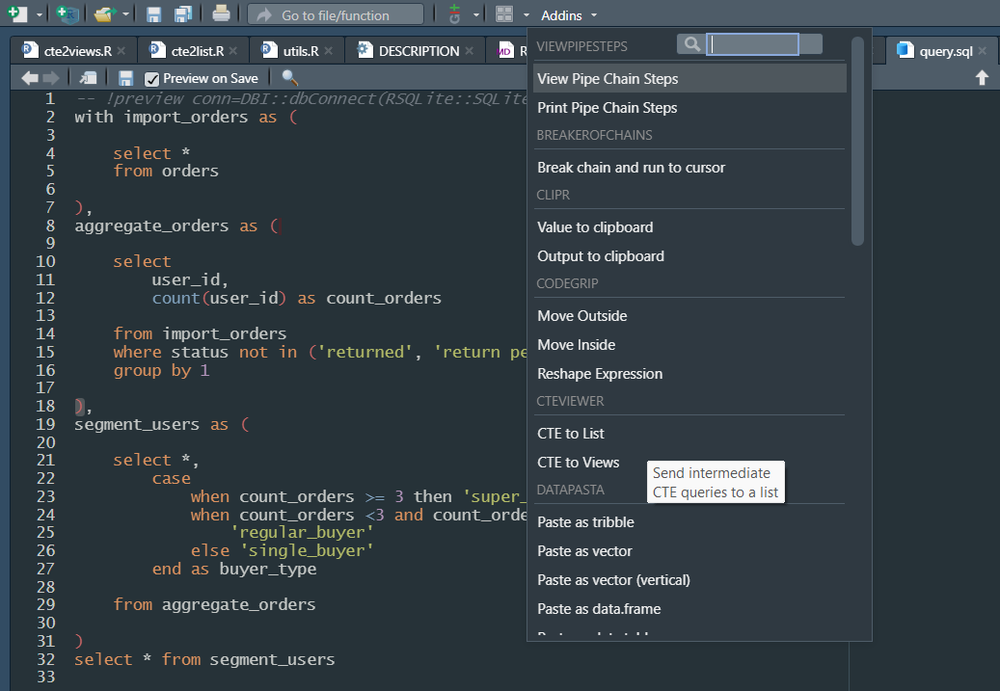

<!-- README.md is generated from README.Rmd. Please edit that file -->

# cteviewer

<!-- badges: start -->


<!-- badges: end -->

Examining CTE SQL queries can be cumbersome, what with the commenting
out, copy-pasting, and re-selecting. cteviewer brings the intermediate
CTE expressions into R for easier access and further scrutiny. Invoke
the Rstudio add-ins to bring the expressions into your environment as a
list or as View() tabs. See screenshot below.

## Installation

You can install the development version of cteviewer like so:

``` r
remotes::install_github("daranzolin/cteviewer")
```

## Example

The following data and query were taken from [dbt-labs Jaffle Shop
repo.](https://github.com/dbt-labs/jaffle_shop)

``` r
library(cteviewer)
library(DBI)
library(readr)

orders <- read_csv("https://raw.githubusercontent.com/dbt-labs/jaffle_shop/main/seeds/raw_orders.csv")
con <- dbConnect(RSQLite::SQLite(), ":memory:")
dbWriteTable(con, "orders", orders)
dbDisconnect(con)
```

In the following example, I have `query.sql` open in RStudio:

``` sql
with import_orders as (

    select *
    from orders

),
aggregate_orders as (

    select
        user_id,
        count(user_id) as count_orders

    from import_orders
    where status not in ('returned', 'return pending')
    group by 1

),
segment_users as (

    select *,
        case
            when count_orders >= 3 then 'super_buyer'
            when count_orders <3 and count_orders >= 2 then
                'regular_buyer'
            else 'single_buyer'
        end as buyer_type

    from aggregate_orders

)
select * from segment_users
```

Now I can invoke the add-ins:

<figure>

<figcaption aria-hidden="true">cteviewer-screenshot</figcaption>
</figure>

‘CTE to List’ returns a list:

``` r
str(cte_dfs) # you have the option to name the output list when running the add-in.
#> List of 3
#>  $ import_orders   :'data.frame':    99 obs. of  4 variables:
#>   ..$ id        : num [1:99] 1 2 3 4 5 6 7 8 9 10 ...
#>   ..$ user_id   : num [1:99] 1 3 94 50 64 54 88 2 53 7 ...
#>   ..$ order_date: num [1:99] 17532 17533 17535 17536 17536 ...
#>   ..$ status    : chr [1:99] "returned" "completed" "completed" "completed" ...
#>  $ aggregate_orders:'data.frame':    60 obs. of  2 variables:
#>   ..$ user_id     : num [1:60] 1 3 6 7 8 9 11 12 13 16 ...
#>   ..$ count_orders: int [1:60] 1 3 1 1 2 1 1 1 1 1 ...
#>  $ segment_users   :'data.frame':    60 obs. of  3 variables:
#>   ..$ user_id     : num [1:60] 1 3 6 7 8 9 11 12 13 16 ...
#>   ..$ count_orders: int [1:60] 1 3 1 1 2 1 1 1 1 1 ...
#>   ..$ buyer_type  : chr [1:60] "single_buyer" "super_buyer" "single_buyer" "single_buyer" ...
```

Note that the intermediate queries are actually written to your database
before being deleted afterwards.
